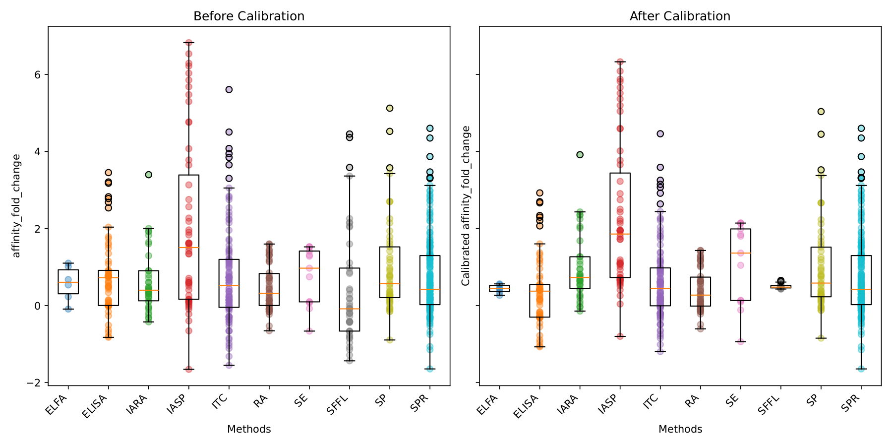
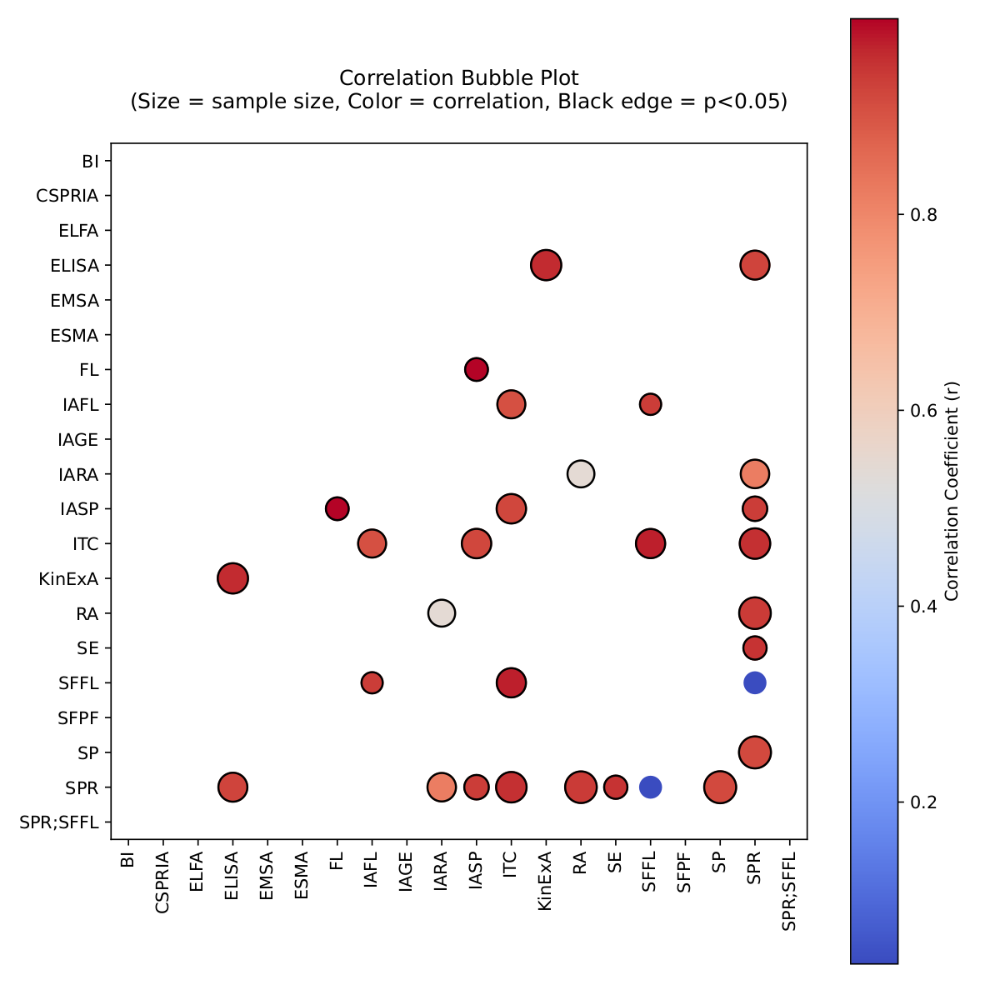

# Cross-Assay Normalization of Protein–Protein Binding Affinities

Binding affinities for the same protein–protein mutation, measured by different
experimental assays, are not directly comparable. This repository calibrates
affinity measurements from 20 assay method codes onto a single common scale — surface
plasmon resonance (SPR) — so that measurements pooled from heterogeneous sources
can be used together, and quantifies how much that calibration improves
between-assay agreement.

The calibration is built on [SKEMPI v2](https://life.bsc.es/pid/skempi2), which
covers protein–protein complexes generally rather than one interaction class.

Because a cross-assay comparison needs the same mutation measured more than
once, the pipeline keeps only mutations carrying two or more distinct `Method`
values. That is the binding constraint on scale: **339 mutations**, drawn from
813 individual measurements, out of the 7,036 non-`n.b.` rows in SKEMPI v2.
Every number and figure in this repository rests on those 339.

No complex-type filter is applied, and the 339 are mixed. By SKEMPI's
`Hold_out_type` label, 18.0% are antibody–antigen, 8.3% protease/inhibitor and
4.1% TCR/peptide–MHC; the remaining 69.6% carry no label and are dominated by
hormone–receptor and enzyme–inhibitor systems — growth hormone / hGH binding
protein, interferon alpha-2 / its receptor, TEM-1 beta-lactamase / BLIP and
Ras / RBD together account for well over a third of all measurements used.
The results below therefore describe protein–protein binding broadly, and
should not be read as antibody-specific.

<p align="center">
  
</p>

<p align="center">
  <em>Per-assay fold-change distributions before (left) and after (right) calibration
  onto SPR. <a href="results/summary/comparison_before_after_calibration_boxplot.pdf">PDF</a></em>
</p>

<p align="center">
  
</p>

<p align="center">
  <em>Agreement between assay pairs — colour is −log10(q), size is the number of
  shared mutations. <a href="results/summary/bubble.pdf">PDF</a></em>
</p>

## Method

For each mutation the raw quantity is a **log10 affinity fold change**

```
y = log10( Kd_mut / Kd_wt )
```

computed per assay method, giving a matrix of mutations (rows) × assay methods
(columns). Non-binding mutants (`Affinity_mut (M) == "n.b."`) and non-positive
ratios are excluded.

SPR is taken as the reference assay. For every other method *m*, an ordinary
least-squares fit is performed over the mutations measured by **both** *m* and
SPR:

```
y_SPR  =  alpha + beta * y_m
```

That fit is then applied to the whole of column *m*, mapping it onto the SPR
scale. Methods overlapping SPR on fewer than 3 mutations are dropped to `NaN`
rather than extrapolated.

Agreement before and after calibration is reported as Pearson and Spearman
correlation matrices, with significance assessed by a permutation test
(`pearson_permutation_test`, 10,000 permutations) and Benjamini–Hochberg FDR
correction.

Assay codes follow the `Method` field of SKEMPI v2: BI, CSPRIA, ELFA, ELISA,
EMSA, ESMA, FL, IAFL, IAGE, IARA, IASP, ITC, KinExA, RA, SE, SFFL, SFPF, SP, SPR
and the composite code `SPR;SFFL`. See the SKEMPI v2 documentation for their
definitions.

## Layout

```
data/
  raw/           SKEMPI v2 tables — supplied, not produced here (see data/raw/README.md)
  processed/     every matrix the pipeline computes
src/
  calibrate.py   the calibration: raw -> processed + most figures
  figures.py     correlation heatmaps from the processed matrices
results/
  calibration/                    per-assay before/after scatter vs SPR
  correlation_affinity/           pairwise assay correlation, affinity
  correlation_ddg/                pairwise assay correlation, ddG
  correlation_ddg_no_nonbinding/  same, excluding non-binders
  summary/                        heatmaps, FDR bubble, before/after boxplot
docs/
  literature.txt            background reading
```

The flow is one direction: `data/raw` → `src/calibrate.py` → `data/processed`
→ `src/figures.py` → `results/`.

This repository contains the normalization study only. The originating project
also held ~270 GB of third-party database staging directories (IEDB, TDC, CATH,
HSPVdb, BioLiP and others) and AlphaFold prediction output; none of that is
included here. See *Data* below.

## Reproducing

```bash
pip install -r requirements.txt
python src/calibrate.py     # data/raw -> data/processed + results/
python src/figures.py       # data/processed -> results/summary/
```

Both scripts anchor themselves to the repository root, so they can be run from
any working directory.

`src/calibrate.py` writes:

| Output | Contents |
| --- | --- |
| `data/processed/affinity_calibrated.csv` | calibrated matrix, mutations × assays |
| `data/processed/calibrated_corr.csv` | assay × assay correlation **after** calibration |
| `data/processed/affinity_corrarray.csv` | correlation **before** calibration |
| `data/processed/affinity_q_matrix.csv` | BH-FDR q-values per assay pair |
| `data/processed/energy_difference_correlation.csv` | Spearman correlation of ddG |
| `data/processed/delta_delta_G_*_corrarray.csv` | ddG correlations, with/without non-binders |
| `results/calibration/` | per-assay before/after scatter vs SPR |
| `results/correlation_*/` | pairwise assay correlation figures |
| `results/summary/` | FDR bubble, value plot, before/after boxplot |

`src/figures.py` reads `data/processed/affinity_corrarray.csv` and writes
`heatmap.pdf`, `clusteredheatmap.pdf`, `bubble.pdf` and `correlation_scatter.pdf`
into `results/summary/`.

## Data

The SKEMPI v2 tables needed for the calibration are included. The bulk inputs —
PDB structure sets, AlphaFold output and the per-database dumps — are **not**
redistributed here. Obtain them from their upstream
sources (SKEMPI v2, IEDB, SAbDab, TDC, BindingDB, BioLiP, IMGT) under those
projects' own terms, which differ from the license of this code.

## Status and caveats

- The calibration fits a single global linear map per assay. It does not model
  per-complex or per-interface effects, and assays overlapping SPR on few
  mutations give correspondingly unstable fits — `ELFA` correlates with SPR at
  r ≈ 0.39 against `ELISA` at r ≈ 0.93.

## License

Code in this repository is released under the MIT License (see `LICENSE`).
The third-party datasets it consumes (SKEMPI v2, IEDB, SAbDab, TDC, BindingDB,
BioLiP, IMGT) are **not** covered by that license and remain subject to their
own terms.
